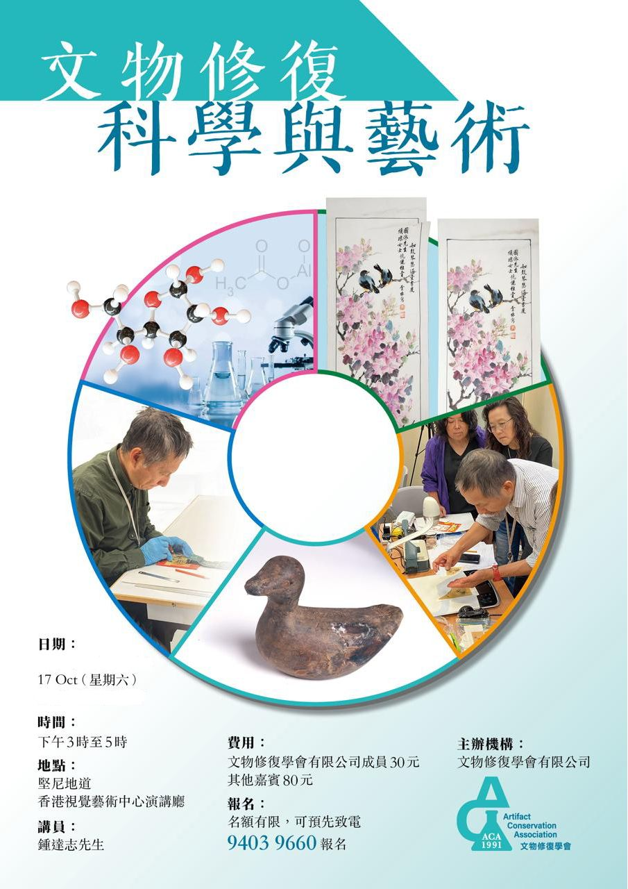

# Conservation Talk in October 2026
A Free Conservation Talk is organized to public in October 2026
<html lang="en">
<head>    
<meta charset="UTF-8">    
<meta name="viewport" content="width=device-width, initial-scale=1.0">    
<title>Conservation Talk for public</title>    

</head>
<body>    
<h1> </h1>    

        

<strong>Nov of 2026</strong>
        

<strong>Target Audience:</strong>General Public who is interested in Material Conservation
    

    
<!-- 把下面的 A3 poster.png 换成你上传的图片实际文件名 -->    

</body>
</html>
